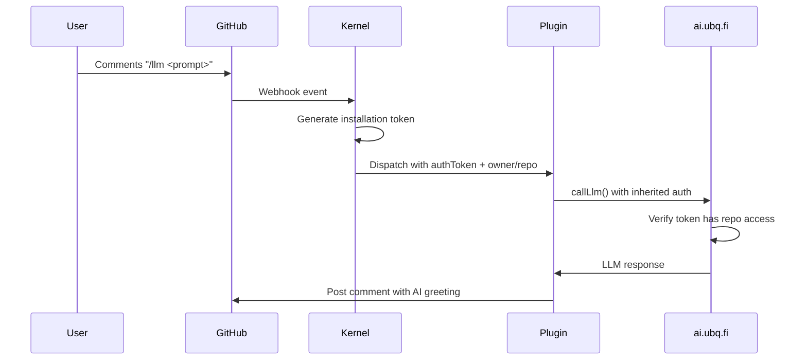

# Kernel & Plugin Testing Guide (For LLM Agents)

Use this guide to validate kernel/plugin changes quickly. Prefer the mocked Jest tests first; use the CLI harness only when you need to exercise HTTP plugins.

## Research Policy (UbiquityOS)

- Do NOT use Perplexity or any web search for UbiquityOS internals, configs, or behavior; there is no public documentation.
- For UbiquityOS research, rely on local code, tests, and docs in this repository (use `rg` and read source).
- If the question is about non-UbiquityOS dependencies or general tooling, external research is allowed; otherwise stay local.

## Secrets & Env Naming

- Never use `UBQ_` in secret/property/key names; use `UOS_` instead.
- When defining TypeBox schemas, do not mark fields as optional if a default is provided; keep them required with defaults.

## ☁️ Serverless Constraints

- Never rely on in-memory storage or caches for correctness; assume stateless Deno Deploy instances and use durable storage (e.g., KV) for cross-request state.

## 🧭 Routing & Prompting Policy

- **Never** implement AI behavior based on keyword/regex triggers (e.g., `if (text.includes("install")) …`) to pick tools/plugins. If the model is making a decision, that decision must be prompt-driven.
- Explicit user-facing commands are fine as entrypoints (e.g., `/help`, `/config`, `@UbiquityOS agent`) — but what happens after the entrypoint must be determined by instructions + context, not brittle string matching.
- Modern LLMs are capable of correct decisions when we (1) provide effective instructions and (2) distill the relevant context; prefer improving prompts/context over adding special-case code paths.
- Keep prompts lightweight by default; only include heavier context (full plugin defaults/schemas) on demand.

## 🚀 Quick Start

This is a Deno-based project; the runtime server is Deno, and Bun is only used as a task runner for scripts/tests.

```bash
bun install

# Only needed if you're working on plugin submodules under lib/plugins/
bun run setup:plugins
```

## 🔗 Local plugin-sdk development (linking)

If you're editing `lib/plugin-sdk` locally and want other packages/plugins to use it before publishing to npm:

```bash
# 1) Build the SDK (exports point at dist/)
cd lib/plugin-sdk
bun install
bun run build

# 2) Register it globally for bun link
bun link

# 3) Link it into a consumer package (example: lib/plugins/hello-world-plugin)
cd ../plugins/hello-world-plugin
bun install
bun link @ubiquity-os/plugin-sdk
```

To undo:

```bash
cd lib/plugins/hello-world-plugin
bun unlink @ubiquity-os/plugin-sdk
cd ../plugin-sdk
bun unlink
```

## ✅ Unit Tests (Mocked, No Real API Calls)

The Jest suite mocks external dependencies (GitHub API, LLM calls, plugin manifests/dispatch) via MSW.

```bash
# List all tests
bun run jest:test -- --listTests

# Run the kernel-focused suite
bun run jest:test -- tests/kernel.test.ts

# Run a single test by name
bun run jest:test -- tests/kernel.test.ts -t "process /hello"
```

Note: `bun test` is not used for this suite (tests rely on Jest-only APIs like `jest.requireActual`).

## 🔌 Local HTTP Plugin Dispatch (Optional)

`scripts/test-command.ts` is a local harness that:

- Downloads a repo config from GitHub (`.github/.ubiquity-os.config.dev.yml` then `.github/.ubiquity-os.config.yml`)
- Caches it to `.test-cache/config.<org>.<repo>.yml` (first run downloads + exits; rerun to execute)
- Fetches each HTTP plugin's `manifest.json`
- For slash commands (`/hello`), POSTs a kernel-shaped payload to the matching plugin URL

Example:

```bash
# Terminal A: start the local hello-world HTTP plugin (127.0.0.1:9090)
bun run plugin:hello-world

# Terminal B: provide a token so the harness can download config
export GITHUB_TOKEN=***redacted***

# First run caches config and exits; run again to dispatch
# (target repo must have a .github/.ubiquity-os.config*.yml that includes http://127.0.0.1:9090 under plugins:)
bun run scripts/test-command.ts hello https://github.com/0x4007/ubiquity-os-sandbox/issues/2
```

Limitations:

- Only HTTP plugins (config keys that are URLs) are supported; GitHub Action plugins are not executed by this tool.
- `/help` and `@UbiquityOS …` routing is not implemented (slash-command dispatch only).
- The harness currently uses a mock plugin `authToken`, so plugins that call GitHub typically return `401 Unauthorized` (expected). To fully exercise a plugin, update `scripts/test-command.ts` to pass a real token and use a sandbox repo/issue.

## 🧪 End-to-End Plugin Testing

For complete autonomous testing of plugin commands, use the simplified CLI with GitHub CLI verification:

### **Prerequisites**

```bash
# Install GitHub CLI and authenticate
gh auth login

# Set up environment variables
export APP_ID=your_github_app_id
export APP_PRIVATE_KEY="$(cat path/to/private-key.pem)"
```

### **Complete E2E Test Flow**

1. **Start your plugin locally** (if testing HTTP plugins):

```bash
# Example for hello-world plugin
bun run plugin:hello-world  # Runs on http://127.0.0.1:9090
```

2. **Execute command via test harness**:

```bash
# Simple syntax: command + GitHub URL
bun run test-command hello https://github.com/0x4007/ubiquity-os-sandbox/issues/2
```

3. **Verify comment was posted**:

```bash
# Check the latest comment on the issue
gh issue view 2 --repo 0x4007/ubiquity-os-sandbox --comments --json comments | jq '.comments[-1].body'
```

4. **Full autonomous verification**:

```bash
# One-liner to test and verify
bun run scripts/test-command.ts hello https://github.com/0x4007/ubiquity-os-sandbox/issues/2 && \
sleep 3 && \
echo "🔍 Verifying comment was posted..." && \
gh issue view 2 --repo 0x4007/ubiquity-os-sandbox --comments --json comments | jq -r '.comments[-1].body'
```

### **Testing Different Commands**

```bash
# Test help command
bun run test-command help https://github.com/0x4007/ubiquity-os-sandbox/issues/3 && \
sleep 3 && \
gh issue view 3 --repo 0x4007/ubiquity-os-sandbox --comments --json comments | jq -r '.comments[-1].body'

# Test wallet command
bun run test-command wallet https://github.com/0x4007/ubiquity-os-sandbox/issues/4 && \
sleep 3 && \
gh issue view 4 --repo 0x4007/ubiquity-os-sandbox --comments --json comments | jq -r '.comments[-1].body'
```

### **Automated Testing Script**

Create `test-plugin-e2e.sh` for automated testing:

```bash
#!/bin/bash
set -e

COMMAND=$1
ISSUE_URL=$2
REPO=$(echo $ISSUE_URL | sed 's|https://github.com/\([^/]*\)/\([^/]*\)/issues/\([0-9]*\)|\1/\2|')
ISSUE_NUM=$(echo $ISSUE_URL | sed 's|https://github.com/\([^/]*\)/\([^/]*\)/issues/\([0-9]*\)|\3|')

echo "🧪 Testing /$COMMAND on $REPO issue #$ISSUE_NUM"

# Execute command
bun run test-command $COMMAND $ISSUE_URL

# Wait for processing
sleep 5

# Verify comment was posted
echo "🔍 Verifying comment..."
COMMENT=$(gh issue view $ISSUE_NUM --repo $REPO --comments --json comments | jq -r '.comments[-1].body')

if [[ $COMMENT == *"Error"* ]] || [[ $COMMENT == *"failed"* ]]; then
  echo "❌ Test FAILED - Command returned error"
  echo "Comment: $COMMENT"
  exit 1
else
  echo "✅ Test PASSED - Command executed successfully"
  echo "Comment preview: ${COMMENT:0:100}..."
fi
```

Usage:

```bash
chmod +x test-plugin-e2e.sh
./test-plugin-e2e.sh hello https://github.com/0x4007/ubiquity-os-sandbox/issues/2
```

## 🧩 Kernel Config Paths

The kernel loads and merges plugin config from:
- ENVIRONMENT variable: `UOS_ENVIRONMENT` (e.g., `dev`, `development`, `prod`, `production`, `pi`, `mac` etc)
- Repo config: `.github/.ubiquity-os.config.yml` (production) or `.github/.ubiquity-os.config.ENVIRONMENT.yml` (i.e. .github/.ubiquity-os.config.dev.yml)
- Org repo config: `<OWNER>/.ubiquity-os` using the same paths

## 📜 Deno Dashboard Logs (CLI)

To accelerate debugging/feedback loops, use the internal dashboard logs fetcher:

```bash
# Beta (develop) logs, last hour
deno task dash-logs:beta
deno task dash-logs --project-id=7f8de540-0885-4313-84c8-d3d6b3a40a49 --deployment-id=ktca8xhgvq5d --since=1h --format=ndjson

# Production logs, last hour (deployment-id=latest works)
deno task dash-logs --project-id=ac40defb-c3ad-4253-a39b-34bf9731217a --deployment-id=latest --since=1h --format=ndjson

# AI-friendly prod logs (NDJSON) and human-friendly prod logs (table)
deno task dash-logs:ai
deno task dash-logs:human
```

Auth uses the dashboard cookie token (no public API). Set `DENO_DEPLOY_TOKEN` in the shell, or pass `--token=...` explicitly.

Findings:

- The dashboard logs endpoint is internal (`dash.deno.com/_api/.../query_logs`) and has no public API docs; it is accessed via the dashboard cookie token (`token=...`).
- The `message` field is sometimes a JSON string and sometimes plain text; keep raw NDJSON for AI parsing and avoid assuming schema.

For fast beta debugging with a feedback loop, prefer `deno task dash-logs:beta` (NDJSON) and `deno task dash-logs:human` (table) when a human needs to scan logs quickly.

## 🚨 Troubleshooting

```bash
# Port 9090 already in use
lsof -nP -iTCP:9090 -sTCP:LISTEN

# Reset Jest cache (useful after module-level mock changes)
bun run jest:test -- --clearCache
```

## 🧪 Telegram E2E Test Accounts (Local)

Use dedicated test identities for Telegram end-to-end runs so real accounts are never touched.

- GitHub test owner: `ubiquity-os-simulant` (dedicated GitHub user).
  - Required repo: `ubiquity-os-simulant/.ubiquity-os` (Issues enabled, GitHub App installed).
- Telegram test user (MTProto session used by scripts): `@UbiquityOS` (`userId=6519561033`).
  - Stored in `.secrets/telegram.json` as `apiId`/`apiHash`/`userSession` (do not commit).

### Test PAT

- `GITHUB_TOKEN_SIMULANT`: PAT for `ubiquity-os-simulant` used only for automated E2E testing (ex: closing the link-approval issue in `scripts/telegram-link-live-e2e.ts`).
- Permissions: must be able to close issues in `ubiquity-os-simulant/.ubiquity-os`.
  - Classic PAT: `repo` scope recommended.
  - Fine-grained PAT: include `ubiquity-os-simulant/.ubiquity-os` and grant Issues `write`.

## 🤖 LLM SDK & ai.ubq.fi Integration

Plugins can securely call the ai.ubq.fi LLM endpoint using inherited GitHub authentication—no manual tokens needed. The kernel dispatches with short-lived installation tokens, and the API verifies repo access.

### Model Policy

- Agentic runs must use `gpt-5.3-codex` (do not downgrade to `gpt-5.2*`).
- Router/chat usage should use `gpt-5.3-chat-latest`.

### LLM SDK Overview

The LLM functionality is integrated into `@ubiquity-os/plugin-sdk` as `callLlm()`:

- **HTTP Plugins**: Import `callLlm` from plugin-sdk.
- **GitHub Actions Plugins**: Use the composite action.
- **Kernel**: Direct import for internal use.

#### Usage Examples

**HTTP Plugin**:

```typescript
import { PluginInput, createPlugin, callLlm } from "@ubiquity-os/plugin-sdk";

export default createPlugin({
  async onCommand(input: PluginInput) {
    const result = await callLlm({ messages: [{ role: "user", content: "Hello!" }] }, input);
    // result: ChatCompletion or AsyncIterable<ChatCompletionChunk>
  },
});
```

**GitHub Actions Plugin**:

```yaml
- uses: ubiquity-os/ubiquity-os-kernel/.github/actions/llm-call@main
  with:
    auth-token: ${{ inputs.authToken }}
    owner: ${{ github.repository_owner }}
    repo: ${{ github.event.repository.name }}
    messages: '[{"role":"user","content":"Query"}]'
```

### Security & Verification

Plugins inherit `authToken` (GitHub app installation token) from kernel dispatch. The API (`ai.ubq.fi/serve.ts`) verifies:

1. **Token Format**: Must start with 'gh' and include `X-GitHub-Owner/Repo` headers.
2. **Repo Access Check**: Uses Octokit to list authenticated repos (paginated to handle >100 repos), confirms token grants access to the exact owner/repo.
3. **Caching**: Verifications cached for 5 min per token+repo to reduce API calls.
4. **Installation Scoping**: Tokens are per-installation; repo check implicitly verifies installation validity. Optional explicit `X-GitHub-Installation-Id` header for extra assurance.

#### GitHub Token Verification Flow

```typescript
// In requireClientAuth()
if (token.startsWith("gh") && req.headers.has("X-GitHub-Owner") && req.headers.has("X-GitHub-Repo")) {
  const owner = req.headers.get("X-GitHub-Owner")!;
  const repo = req.headers.get("X-GitHub-Repo")!;
  const cacheKey = await sha256Base64Url(token + owner + repo);
  if (cached) return null; // Allow

  const octokit = new Octokit({ auth: token });
  let page = 1,
    hasAccess = false;
  while (!hasAccess) {
    const { data: repos } = await octokit.rest.repos.listForAuthenticatedUser({ per_page: 100, page });
    hasAccess = repos.some((r) => r.owner.login === owner && r.name === repo);
    if (hasAccess || repos.length < 100) break;
    page++; // Paginate
  }
  if (hasAccess) {
    cache.set(cacheKey, Date.now() + 5 * 60_000);
    return null; // Allow
  }
  return openaiError(401, "Invalid GitHub token for repo", "invalid_auth_for_repo");
}
```

- **Pagination**: Loops through repo pages to avoid false negatives for large orgs.
- **No Storage**: Tokens verified on-the-fly; not persisted.
- **Fallback**: Existing API keys/KV auth still work.

### Testing LLM Calls

Use the test harness with LLM-enabled plugins:

```bash
# Test plugin that calls LLM
bun run test-command llm-query https://github.com/0x4007/ubiquity-os-sandbox/issues/5
# Verify response in issue comments
```

### Relevant Files

- `lib/plugin-sdk/src/llm/index.ts` - Core callLlm function
- `.github/actions/llm-call/action.yml` - Composite action
- `lib/ai.ubq.fi/serve.ts` - API with GitHub verification
- `src/github/handlers/index.ts` - Dispatch with authToken
- `lib/plugin-sdk/src/signature.ts` - PluginInput types

### Auth Flow Diagram



## 🔗 Relevant Files

- `scripts/test-command.ts`
- `scripts/setup-plugins.ts`
- `src/github/utils/config.ts`
- `src/github/utils/plugins.ts`
- `src/github/utils/workflow-dispatch.ts`
- `tests/kernel.test.ts`
